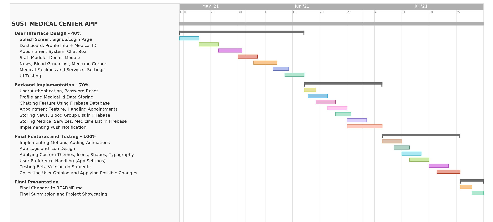

# G36-Medical-Center-Automation

Expected Timeline
-----------------

Report on Learning Pre-requisites
----------------------------------

SL |  Learning Task  | Description |    Status    | Comment |
--:|:----------------|:------------|:------------:|---------|
1  | Android Basics    | JAVA(OOP), Activities, Intents, Navigation, Fragments, Manifest,  Dependency Injection, Background tasks and Scheduling, Shared Preference  | -done-success)         | |
2  | UI Design Basics  | XML, Layouts, Views, Drawables, Styles and Themes, Motions, Recycler View, User Interaction, Material Design Library  |         
3  | Firebase Database  | User Auth, Password reset, Firestore, Realtime Database, Firebase Storage|      |  |
4  | Push Notifications | Firebase Cloud Messaging(FCM), Notification API |     |  |

\
\
Server Application 
------------------
We created a server application for our app and it helps to delete previous day applications and add a new day to make new appointments. It's meant to do this task everyday once. As we couldn't deploy this app to the cloud, we will manually run this server app everyday.  
Here is the link to it's github repository: [SUST Medical Center App Server](https://github.com/AmirHamza11/SUST-Medical-Center-Server)  
  
\
\
Used Technologies
-----------------
* Android SDK
* JAVA
* Google Firebase:  
    * Firebase Authentication  
    * Fireabase Firestore
    * Firestore Admin SDK
    * Realtime Database
    * Fireabase Storage
* Node.js
* Github
* External Libraries: 
    * [Picasso](https://github.com/square/picasso) 
    * [CircleImageView](https://github.com/hdodenhof/CircleImageView)
    * [lottie-android](https://github.com/airbnb/lottie-android)

\
\
Functionalities
---------------
### Implemented Features:
* **Signing Up with Email & Password.**  
    Contributor(s): Ishrat Jahan, Amir Hamza.
* **Creating User Accounts(Studends,Doctors,Moderators).**  
    Contributor(s): Ishrat Jahan, Amir Hamza.
* **Authenticating Users.**  
    Contributor(s): Amir Hamza.
* **Modifying User Details.**  
    Contributor(s): Ishrat Jahan.
* **Scheduling New Appointments.**  
    Contributor(s): Ishrat Jahan, Amir Hamza.
* **List of User's All Appointments(Due & Completed).**  
    Contributor(s): Ishrat Jahan, Amir Hamza.
* **Managing Appointments(Moderator).**  
    Contributor(s): Amir Hamza.
* **Chatting between Doctor & Patient.**  
    Contributor(s): Amir Hamza.
* **User Presence.**  
    Contributor(s): Amir Hamza.
* **Adding & Modifying Prescription in Appointments.**  
    Contributor(s): Ishrat Jahan, Amir Hamza.
* **Creating & Viewing Important News Regarding Health and Medical Services.**  
    Contributor(s): Ishrat Jahan, Amir Hamza.
* **Blood Group & Donation Details of All Users.**  
    Contributor(s): Ishrat Jahan, Amir Hamza.
* **SUST Medical Center Services Details.**  
    Contributor(s): Ishrat Jahan.
* **Full Details About Available Medicines in Medical Center.**  
    Contributor(s): Ishrat Jahan.
* **All Informations About SUST Medical Center.**  
    Contributor(s): Ishrat Jahan.  
 
  
### Unimplemented Features:
* **Push Notification.**    
    N.B: Requires A Server. Servers Require Filling In Billing Informations.
* **Some Functionalities Related to Settings.**

\
\
Acknowledgement 
---------------
* **Enamul Hassan**  
    Assistant Professor  
    Department of Computer Science and Engineering, SUST.  
      
    Contribution: Course Teacher. Supervised the project and co-operated with us time to time.  
  
\
\
Developers 
----------
**Group Number:** 36  
**Group Name:** Developer_Duo  
**Group Members:**
* **Amir Hamza**  
    Registration No.: 2018331011  
    Email: amirhamza11333@gmail.com  
    Cell: 01625019530  
  
* **Ishrat Jahan**  
    Registration No.: 2018331029  
    Email: i.jahan1533@gmail.com  
    Cell: 01721021533  
  
  
\
\
<small>&copy; 2021 - Dept. of CSE, SUST, BD</small>  
